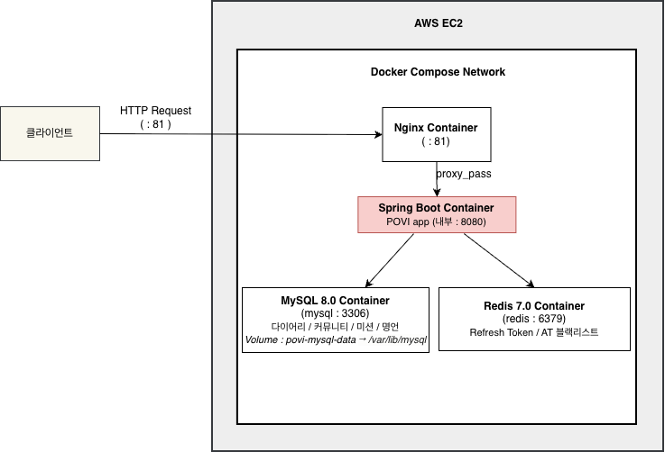
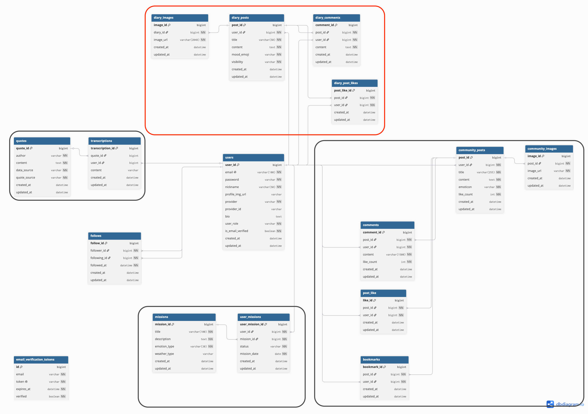

# POVI
Java 21 · Spring Boot · MySQL

일상을 기록하고, 친구와 감정을 공유할 수 있는 **감정 공유 다이어리 서비스**입니다.

---

## 📌 프로젝트 소개

공개 범위 정책을 기반으로 감정을 기록하고 친구와 공유할 수 있는 감정 공유 다이어리 서비스입니다.

---

## 🙋 담당 파트

* 다이어리 게시글 CRUD
* 댓글 · 좋아요 기능 구현
* 공개 범위 정책(PUBLIC / FRIEND / PRIVATE) 설계
* 이미지 업로드 기능 구현
* 친구 피드 · 탐색 피드 조회 기능 구현
* 피드 조회 성능 개선(N+1 해결)

---

## ✨ 핵심 기능

※ 전체 서비스 기준 기능입니다.

| 기능 | 설명 |
| --- | --- |
| 회원 인증 | JWT 로그인 · 이메일 인증 · Google/Kakao OAuth2 |
| 다이어리 | 감정 기록, 공개 범위 설정, 이미지 첨부 |
| 피드 | 친구 피드 · 전체 탐색 피드 |
| 커뮤니티 | 익명 게시글 · 댓글 · 좋아요 · 북마크 |
| 명언 & 필사 | 오늘의 명언 제공 및 필사 저장 |
| 날씨 | 현재 위치 기반 날씨 조회 |

---

## 🛠 Tech Stack

| 구분 | 기술 |
| --- | --- |
| Backend | Java 21, Spring Boot, Spring Data JPA |
| Auth | Spring Security, JWT, OAuth2 |
| Database | MySQL, Redis |
| Infra | Docker, Nginx, AWS EC2 |

---

## 🏗 시스템 구조

### Architecture



### ERD



> 빨간색 영역은 제가 담당한 다이어리 게시글·댓글·좋아요·이미지 도메인입니다.

---

## 🔍 기술적 고민 및 해결

### 공개 범위 정책 분리

접근 권한 판단 로직을 `DiaryPostAccessPolicy`로 분리했습니다.

* 본인 → 항상 허용
* FRIEND → 상호 팔로우 여부 확인
* PRIVATE → 본인만 조회 가능

### 피드 조회 성능 개선

- 좋아요 수와 댓글 수를 배치 조회로 변경
- 게시글 수와 관계없이 쿼리 수를 3회로 고정

---

## 🚀 실행 방법

```bash
git clone https://github.com/HaheeBahee/povi.git
cd backend

# 환경변수 설정
cp src/main/resources/application-dev.yml.example src/main/resources/application-dev.yml
# application-dev.yml 파일을 열어 값을 채워주세요

# 로컬 DB · Redis 실행
docker compose -f docker-compose.local.yml up -d

# 앱 실행
./gradlew bootRun
```

---

## 📄 API 문서

### Local

http://localhost:8080/swagger-ui/index.html

### Deployment

http://13.124.129.7:81/swagger-ui/index.html

> 개인 AWS EC2 환경에서 운영 중입니다.
> 서버 상태에 따라 일시적으로 접속이 제한될 수 있습니다.

---

## 📂 프로젝트 구조

```text
backend/src/main/java/org/example/povi
 ├── auth
 │   ├── controller       # 로그인, 회원가입, 토큰 재발급
 │   ├── email            # 이메일 인증
 │   ├── token            # JWT 발급 · 검증 · 필터
 │   └── oauthinfo        # OAuth2 사용자 정보
 │
 ├── domain
 │   ├── diary            # 다이어리 (게시글 · 댓글 · 좋아요 · 이미지)
 │   ├── community        # 익명 커뮤니티 (게시글 · 댓글 · 좋아요 · 북마크)
 │   ├── user             # 사용자 · 팔로우 · 프로필
 │   ├── mission          # 오늘의 미션
 │   ├── quote            # 명언
 │   ├── transcription    # 필사
 │   └── weather          # 날씨
 │
 └── global
     ├── config           # Security, Swagger 설정
     ├── exception        # 예외 처리
     └── entity           # 공통 BaseEntity
```

---

## 📝 참고

> 본 저장소는 5인 팀 프로젝트를 개인 포트폴리오용으로 정리한 저장소입니다.
> README와 문서는 제가 담당한 영역을 중심으로 작성했습니다.
